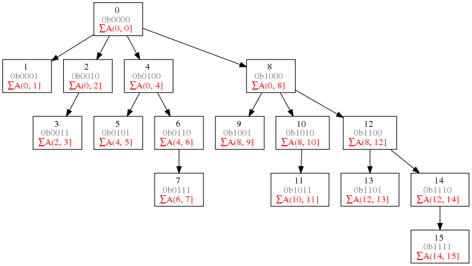

# Fenwick Tree (BIT Tree)

A Fenwick tree of array A[] is a tree stored in a 1-based array F[], where F[i] stores the sum of A[i] and x - 1 preceding numbers. Here x is the place value of the right most 1 of binary representation of i. For example

- F[5] stores sum of value of A[5] because 5 is 0101, place value of right most 1 is 1
- F[6] stores sum of A[5] and A[6] because 6 is 0110, place value of right most 1 is 2
- F[8] stores sum of A[1] thru A[8] because 8 is 1000, place value of right most 1 is 8

Because most operations of a Fenwick tree is related to binary representation of the index value, therefore Fenwick tree is also called Binary Index Tree (BIT). Note that a BIT is not necessarily a binary tree.

## Fenwick tree operations

- Init F[] from number list A[]: 